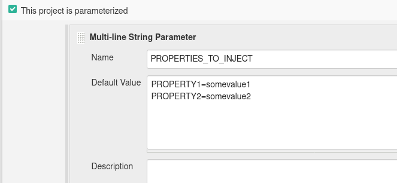
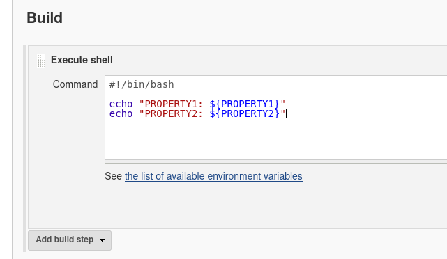

# Global Pre Groovy script Plugin for Jenkins

This plugin makes it possible to execute a groovy script at the start of every job

Features:
* Applies to all jobs/builds run in the server
* Executes a groovy script when a build starts
* Injects any number of variables in the build
* Injects properties based on the content of another property
* Executes a script when the build starts
* Very light plugin
* Failures in the script do not abort the build

## Use cases
* Creating an easy way to pass parameters from one build to another
* Creating n parameters is not desirable
* Working with an unknown/big number of parameters
* Desire to reduce the maintenance of the parameters in the jobs
* Logging the variables used in the builds
* Requiring to execute a script that affects all jobs

## Instalation

1. Clone this repository
2. Upload target/global-pre-script-plugin.hpi to Jenkins -> Manage Jenkins -> Plugin Manager -> Advanced -> Upload plugin


## Configuration

Add the script in the *Global Pre Groovy script* box available at Jenkins -> Manage Jenkins -> Configure System
If the script fails to be evaluated, you will get error message in the Console Output of the job

### Manage Jenkins -> Configure System


## Examples

### Example 1

Injects a new environment variable to all builds, called NEW_PROPERTY
Add this script into the Global Pre Groovy script box:

```groovy
// define a map
def map = [: ]
// add a new property
map['NEW_PROPERTY'] = 'somevalue'

// show what is being injected
map.each { key, value ->
    out.println(String.format("Injected %s: %s", key, value))
}

return map
```
Console output:


### Example 2:

The next script opens the possibility to define only 1 parameter in every job and pass the information between jobs using only 1 parameter
It explodes the contents of the `PROPERTIES_TO_INJECT` and inject its key=value pairs in the environment

#### step 1

Add this script into the Global Pre Groovy script box:

```groovy
if (!binding.hasVariable('PROPERTIES_TO_INJECT')) {
    out.println("Nothing to inject globally. You could add a multiline string parameter and inject pairs of key=value")
    return
}

// define a map
def map = [: ]
PROPERTIES_TO_INJECT.split('\n').each {
    key = it.split('=')[0]
    value = it.split('=')[1]
    map[key] = value
}

// show what is being injected
map.each { key, value ->
    out.println(String.format("Injected %s: %s", key, value))
}

return map
```

#### step 2

Create a freestyle job and add a multi-line string parameter



And an 'Execute shell' build step that will show the environmental variables injected



#### step 3

Build with Parameters filling the multi-line string parameter with this information


#### step 4

And finally, verify the results in the Console Output


### Groovy script usage

The groovy script must return a `Map<String,String>` Java object. You can access parameters and other environment variables through variables in the Groovy script. In the scripts you can also use the following variables.

<dl>

<dt>currentJob</dt>

<dd>Current [hudson.model.Job](http://javadoc.jenkins-ci.org/hudson/model/Job.html) instance.</dd>

<dt>currentBuild</dt>

<dd>Current [hudson.model.Run](http://javadoc.jenkins-ci.org/hudson/model/Run.html) instance.</dd>

<dt>currentListener</dt>

<dd>Current [hudson.model.TaskListener](http://javadoc.jenkins.io/hudson/model/TaskListener.html) instance, which can be used for logging purposes.</dd>

<dt>out</dt>

<dd>Another logging instance as [java.io.PrintStream](https://docs.oracle.com/javase/7/docs/api/java/io/PrintStream.html). It is recommended to use `currentListener` instead of this variable when possible.</dd>

</dl>

All listed variables can be used in both script modes. In the Sandbox mode the access to particular fields and methods may require an additional approval.

## [Jenkins Pipeline](https://jenkins.io/doc/book/pipeline/) Compatibility

There is no need for this plugin when using pipelines and it will not be executed when a pipeline is run

## Changelog

See [GitHub Releases](https://github.com/Orekaria/global-pre-script-plugin/releases) for recent releases.


(powered by [Script Security Plugin](https://plugins.jenkins.io/script-security))
(inspired by [EnvInject Plugin](https://plugins.jenkins.io/envinject))